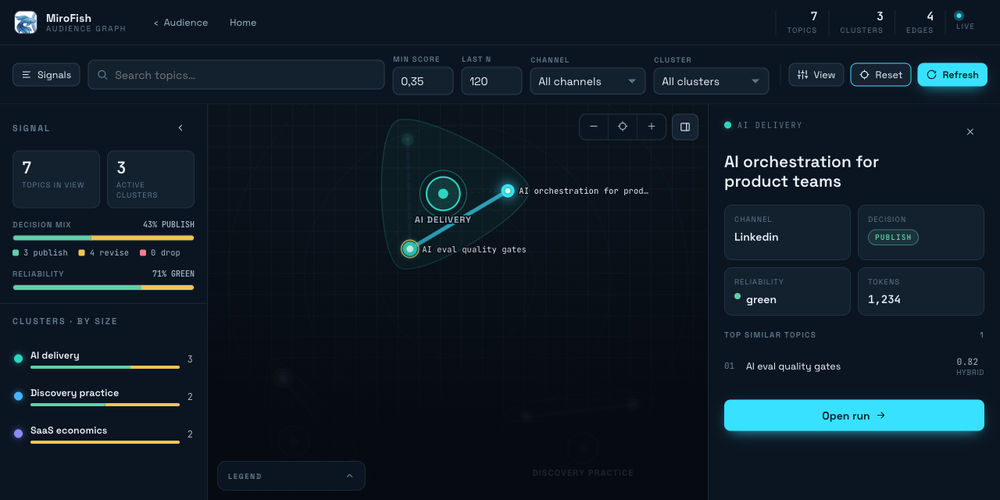
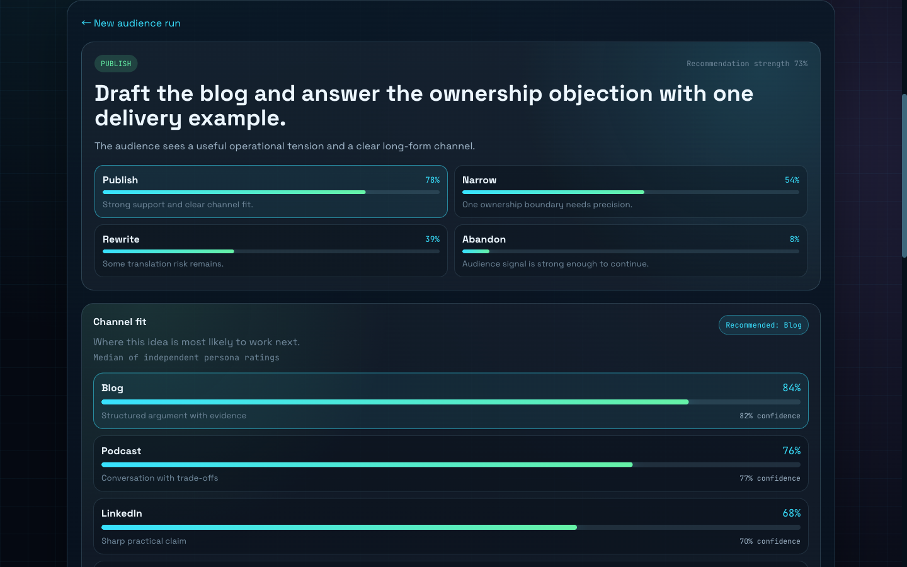
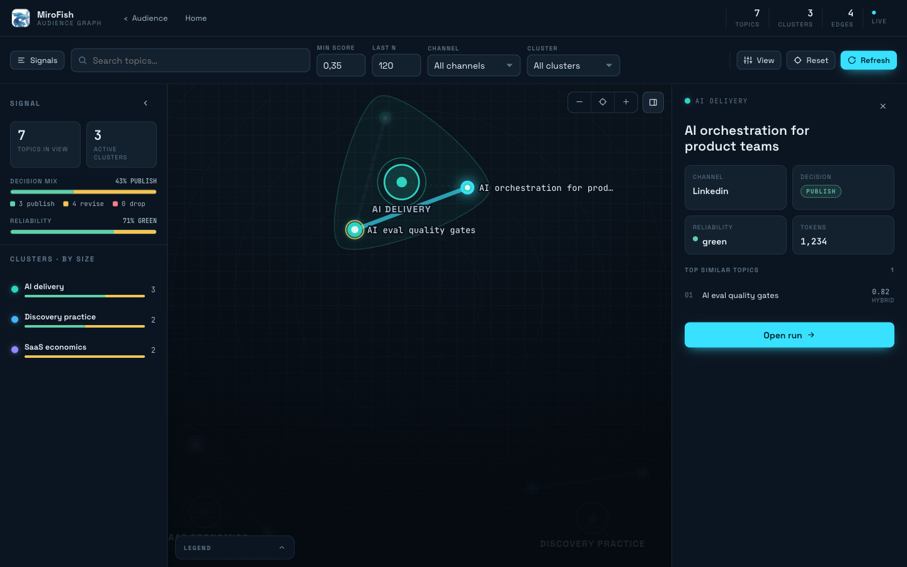
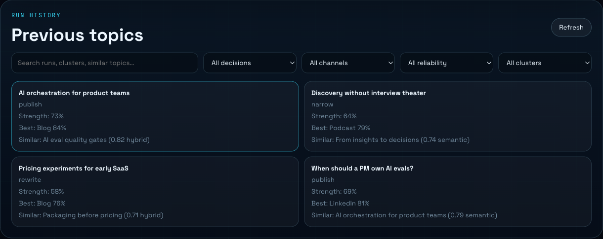
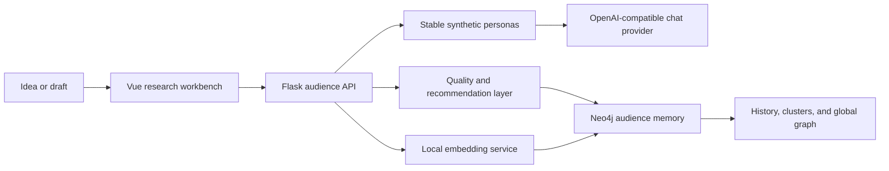

# MiroFish Online

**A synthetic audience graph for pressure-testing content, product, and market ideas before the bigger bet.**

[](https://github.com/pdurlej/mirofish-online/actions/workflows/quality.yml)
[](LICENSE)
[](https://vuejs.org/)
[](https://neo4j.com/)



MiroFish Online runs an idea against a stable set of LLM-backed personas, captures structured reactions and objections, and recommends the next move: publish, rewrite, narrow, change the channel, save it, or abandon it. Every run becomes part of a Neo4j memory graph, so recurring themes form visible branches instead of disappearing into one-off chats.

## Why MiroFish

Generic AI critique is easy to generate and hard to trust. MiroFish turns it into a repeatable research workflow:

- **Stable audience:** compare ideas against the same synthetic perspectives over time.
- **Decision-ready report:** see recommendation strength, objections, insights, and channel fit.
- **Audience memory:** connect new topics to earlier runs through lexical and semantic similarity.
- **Visible trends:** explore clusters and emerging branches in a global D3 graph.
- **Inspectable quality:** track grounding, duplicate responses, fallbacks, retries, latency, and token usage in a sanitized receipt.

It is useful for content creators, product managers, founders, researchers, consultants, and teams that need structured pushback before they publish, build, or pitch.

## Product Tour

### Turn feedback into a next action



Each persona scores every supported channel independently. MiroFish aggregates those scores, surfaces the strongest objections first, and keeps diagnostics available without letting model metadata dominate the report.

### See the whole idea landscape



The global graph groups related topics into clusters, distinguishes lexical, semantic, and hybrid links, and lets you search, filter, zoom, and inspect individual runs.

### Revisit what the audience already learned



History stays scannable as the research base grows: search by topic, filter by decision, channel, reliability, or cluster, and jump directly into the evidence behind a recommendation.

> All screenshots in this repository use a deterministic local fixture. They contain no production topics, provider responses, private URLs, or credentials.

## How It Works



The current product lane is deliberately narrower than a full social simulator. It focuses on a reliable audience graph and useful reports; OASIS/CAMEL-style multi-agent simulation remains a future research direction.

## Quick Start

### Requirements

- Node.js 18+
- Python 3.11 or 3.12
- [`uv`](https://docs.astral.sh/uv/)
- Neo4j 5
- an Ollama-compatible embedding endpoint
- an OpenAI-compatible chat endpoint, local or hosted

### Run locally

```bash
git clone https://github.com/pdurlej/mirofish-online.git
cd mirofish-online
cp .env.example .env
# Configure provider, Neo4j, and embedding values in .env.
npm run setup:all
npm run dev
```

The frontend is available at `http://localhost:3000`; the API runs at `http://localhost:5001`.

Docker Compose deployment examples are included, but host bindings, acceleration, routing, and secret injection are environment-specific. Start with [the deployment guide](docs/deployment.md) rather than exposing the example stack unchanged.

## Quality And Reliability

Schema-valid output is only the first gate. MiroFish also checks whether persona feedback is specific to the topic, whether objections collapse into near-duplicates, and whether provider fallbacks or malformed responses undermine the result.

| Grade | Meaning | Recommended response |
| --- | --- | --- |
| **Green** | Complete, differentiated, well-grounded audience signal | Use the recommendation as decision input |
| **Yellow** | Useful signal with visible quality or provider caveats | Read the objections and diagnostics before acting |
| **Red** | Missing, generic, repeated, or structurally unreliable output | Rerun or change the model/prompt before deciding |

Receipts expose sanitized counts and attribution only. Raw provider errors, raw model output, credentials, and private prompts are not part of the public payload.

## Privacy Model

Privacy depends on deployment and provider configuration:

- Neo4j and embeddings can remain on infrastructure you control.
- Topic content leaves your environment when you select a hosted LLM provider.
- Provider keys belong in runtime secrets, never in the repository or screenshots.
- Neo4j, model endpoints, and internal APIs should not be exposed directly to the public internet.
- Authentication and network policy are deployment responsibilities; the repository does not claim that every installation is offline or private by default.

See [Deployment](docs/deployment.md) for a practical boundary checklist.

## Development

Run the full local quality gate:

```bash
npm run check
```

Focused backend checks:

```bash
cd backend
uv run pytest
```

The suite covers the audience API, graph consistency, similarity and clustering, recommendation quality, browser-facing build, Compose rendering, smoke contracts, linting, and secret scanning.

## Roadmap

Near-term work is focused on calibration and accumulated graph value:

- measure recommendation usefulness across repeatable evaluation batches;
- improve multilingual similarity and cluster explanations;
- compare audience branches and decisions over time;
- make exports and shareable research summaries first-class;
- add optional persona interaction only where it produces better decisions.

See the full [roadmap](ROADMAP.md).

## Upstream Heritage

MiroFish Online builds on ideas and code from [MiroFish-Offline](https://github.com/nikmcfly/MiroFish-Offline), including Neo4j graph storage and the OASIS/CAMEL simulation lineage. This fork focuses first on synthetic audience research, recommendation quality, and a practical topic-memory graph.

## License

[AGPL-3.0](LICENSE)
